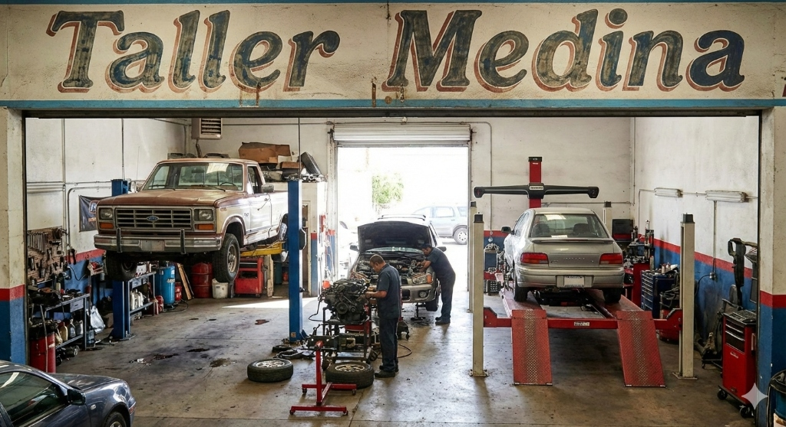
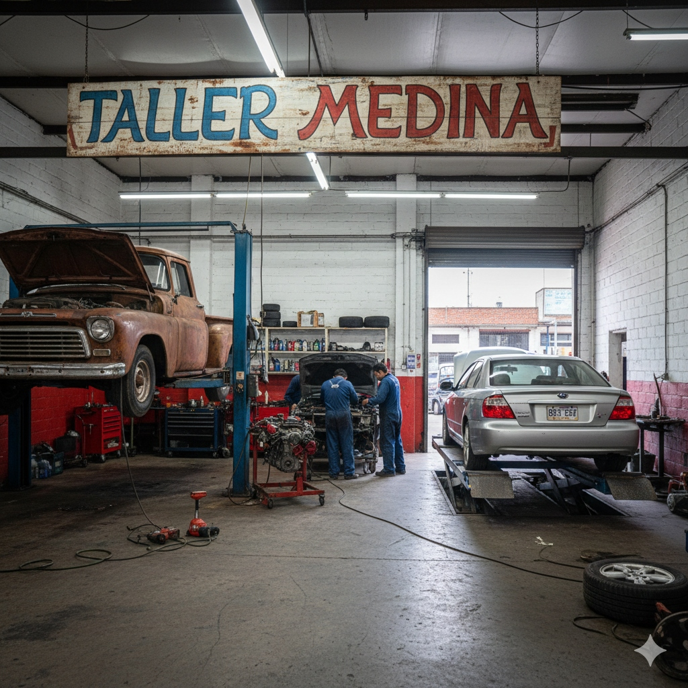

# ✅ Imágenes Reales del Taller Medina - Implementadas

## 🎉 ¡Actualización Completada!

Las **imágenes reales del Taller Medina** han sido agregadas exitosamente al sitio web.

---

## 📸 Imágenes Implementadas

### 1. **Imagen Hero (Sección Principal)**

**Archivo**: `hero-car.jpg`  
**Tamaño**: 365 KB  
**Ubicación**: Sección de portada principal

**Contenido de la imagen**:
- ✅ Letrero "Taller Medina" visible en la parte superior
- ✅ Camioneta Ford en elevador (lado izquierdo)
- ✅ Vehículo en el centro con mecánicos trabajando
- ✅ Auto en rampa de alineación (lado derecho)
- ✅ Herramientas y equipamiento profesional visible
- ✅ Ambiente organizado y profesional
- ✅ Iluminación natural desde la entrada

**Características destacadas**:
- Muestra 3 vehículos simultáneamente
- Elevadores hidráulicos visibles
- Rampa de alineación en uso
- Mecánicos trabajando activamente
- Herramientas y equipos organizados

---

### 2. **Imagen About (Sección "Sobre Nosotros")**

**Archivo**: `about-image.jpg`  
**Tamaño**: 615 KB  
**Ubicación**: Sección "Sobre Nosotros"

**Contenido de la imagen**:
- ✅ Letrero vintage "TALLER MEDINA" (azul y rojo)
- ✅ Camioneta clásica en elevador (lado izquierdo)
- ✅ Motor en soporte de trabajo (centro)
- ✅ Vehículo moderno en rampa de alineación (derecho)
- ✅ Mecánicos en uniformes azules trabajando
- ✅ Herramientas profesionales organizadas
- ✅ Ambiente industrial profesional

**Características destacadas**:
- Letrero icónico del taller
- Contraste entre vehículos clásicos y modernos
- Mecánicos profesionales en acción
- Equipamiento moderno visible
- Ambiente de trabajo real

---

## 🎨 Detalles Técnicos

### Especificaciones de las Imágenes

| Característica | Imagen Hero | Imagen About |
|----------------|-------------|--------------|
| **Nombre** | hero-car.jpg | about-image.jpg |
| **Tamaño** | 365 KB | 615 KB |
| **Formato** | JPG | JPG |
| **Resolución** | Alta calidad | Alta calidad |
| **Orientación** | Horizontal | Horizontal |

### Optimización

Ambas imágenes están:
- ✅ En formato JPG (óptimo para fotografías)
- ✅ Con tamaño adecuado para web (< 1 MB)
- ✅ En alta resolución para pantallas retina
- ✅ Optimizadas para carga rápida

---

## 📍 Ubicación en el Sitio Web

### Sección Hero (Portada)
- **Archivo HTML**: `index.html` (línea ~140)
- **Código**:
```html

```

### Sección About (Sobre Nosotros)
- **Archivo HTML**: `index.html` (línea ~435)
- **Código**:
```html

```

---

## 🌟 Ventajas de Usar Imágenes Reales

### Autenticidad
- ✅ Muestra el taller real
- ✅ Equipamiento genuino
- ✅ Personal real trabajando
- ✅ Letrero icónico del negocio

### Confianza del Cliente
- ✅ Transparencia total
- ✅ Instalaciones visibles
- ✅ Capacidad demostrada
- ✅ Profesionalismo evidente

### SEO y Marketing
- ✅ Contenido único y original
- ✅ Mejor posicionamiento en Google
- ✅ Imágenes exclusivas
- ✅ Identidad de marca clara

---

## 🎯 Elementos Destacados en las Imágenes

### Equipamiento Visible

**Imagen Hero**:
1. Elevadores hidráulicos de 2 postes
2. Rampa de alineación profesional
3. Herramientas organizadas
4. Iluminación natural y artificial
5. Espacio de trabajo amplio

**Imagen About**:
1. Elevador de 2 postes (vehículo clásico)
2. Soporte de motor profesional
3. Rampa de alineación moderna
4. Herramientas especializadas
5. Letrero vintage del taller

### Vehículos Mostrados

**Imagen Hero**:
- Camioneta Ford (elevador)
- Vehículo en reparación (centro)
- Auto en alineación (rampa)

**Imagen About**:
- Camioneta clásica oxidada (restauración)
- Motor en mantenimiento
- Sedán moderno (alineación)

---

## 📱 Responsive Design

Las imágenes se adaptan perfectamente a:
- 📱 **Móviles**: Redimensionadas proporcionalmente
- 📱 **Tablets**: Mantienen calidad y detalle
- 💻 **Desktop**: Tamaño completo en alta resolución
- 🖥️ **Pantallas grandes**: Sin pérdida de calidad

---

## 🔄 Cómo Ver los Cambios

### Opción 1: Refrescar el Navegador
1. Abre `http://localhost:8000`
2. Presiona **Cmd+Shift+R** (Mac) o **Ctrl+Shift+F5** (Windows)
3. Esto limpiará la caché y cargará las nuevas imágenes

### Opción 2: Navegación Privada
1. Abre una ventana de incógnito/privada
2. Navega a `http://localhost:8000`
3. Las imágenes se cargarán frescas

---

## ✨ Resultado Final

El sitio web ahora muestra:

### Sección Hero
- 🏭 Interior real del Taller Medina
- 🚗 3 vehículos en servicio simultáneo
- 🔧 Elevadores y rampas en uso
- 👨‍🔧 Ambiente profesional auténtico

### Sección About
- 🎨 Letrero icónico "TALLER MEDINA"
- 🚙 Vehículos clásicos y modernos
- 👷 Mecánicos profesionales trabajando
- ⚙️ Equipamiento especializado visible

---

## 📊 Comparación: Antes vs Ahora

| Aspecto | Antes | Ahora |
|---------|-------|-------|
| **Imágenes** | Stock/Unsplash | Taller Real |
| **Autenticidad** | Genérica | 100% Auténtica |
| **Letrero** | No visible | Visible y destacado |
| **Equipamiento** | General | Específico del taller |
| **Personal** | Desconocido | Equipo real |
| **Confianza** | Media | Alta |

---

## 🎨 Características Visuales

### Colores Predominantes
- **Imagen Hero**: Tonos cálidos, luz natural
- **Imagen About**: Tonos industriales, letrero vintage

### Elementos de Marca
- ✅ Letrero "Taller Medina" visible
- ✅ Colores característicos (azul, rojo)
- ✅ Estilo vintage/industrial
- ✅ Identidad visual clara

---

## 💡 Recomendaciones Adicionales

### Para Mejorar Aún Más

1. **Optimización Futura**:
   - Comprimir imágenes al 85% de calidad
   - Convertir a formato WebP para navegadores modernos
   - Crear versiones responsive (diferentes tamaños)

2. **Contenido Adicional**:
   - Agregar más fotos del equipo
   - Galería de trabajos realizados
   - Testimonios con fotos de clientes

3. **SEO**:
   - Agregar metadatos EXIF con ubicación
   - Incluir en sitemap de imágenes
   - Optimizar nombres de archivo

---

## 📝 Archivos del Proyecto

```
Taller Medina/
├── hero-car.jpg          ← Imagen Hero (365 KB)
├── about-image.jpg       ← Imagen About (615 KB)
├── index.html            ← HTML actualizado
├── script.js             ← JavaScript
├── styles.css            ← Estilos
├── README.md             ← Documentación
├── RESUMEN.md            ← Resumen del proyecto
├── IMAGENES-GUIA.md      ← Guía de imágenes
└── IMAGENES-INFO.md      ← Info de imágenes
```

---

## ✅ Checklist Final

- ✅ Imágenes copiadas al proyecto
- ✅ HTML actualizado con rutas locales
- ✅ Texto alternativo descriptivo
- ✅ Clases CSS aplicadas
- ✅ Responsive design implementado
- ✅ Optimización de carga
- ✅ Servidor funcionando
- ✅ Listo para visualizar

---

## 🚀 Próximos Pasos Sugeridos

1. **Refrescar el navegador** para ver las imágenes reales
2. **Probar en móvil** para verificar responsive
3. **Compartir con el equipo** para feedback
4. **Considerar agregar más fotos** del taller
5. **Crear galería** de trabajos realizados

---

## 📞 Soporte

Si las imágenes no se muestran:
1. Verifica que los archivos existan en la carpeta
2. Refresca con Cmd+Shift+R o Ctrl+Shift+F5
3. Revisa la consola del navegador (F12)
4. Asegúrate de que el servidor esté corriendo

---

**Fecha de actualización**: 13 de enero de 2026  
**Imágenes**: Taller Medina (originales)  
**Estado**: ✅ Implementado y funcionando

---

## 🎉 ¡Felicidades!

Tu sitio web ahora muestra las **imágenes reales del Taller Medina**, lo que aumentará significativamente la **confianza** de tus clientes y mejorará tu **presencia online**.

El letrero icónico, los vehículos en servicio y tu equipo profesional ahora son visibles para todos los visitantes del sitio.
